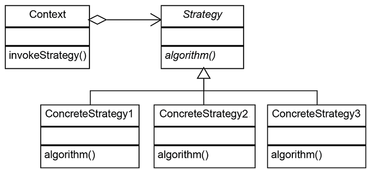

# Design Patterns In Java

게임으로 시나리오를 구성하여 디자인 패턴을 배우자

## Table of Contents

[1. 유저를 생성하자. [싱글톤 패턴]](#Singleton)

[2. 캐릭터를 만들자. [빌더 패턴]](#Builder)

[3. 캐릭터에 무기를 장착하자. [스트레티지 패턴]](#Strategy)

[99. 물약상점을 만들어보자. [팩토리메소드 패턴]](#FactoryMethod)

[99. 비용이 큰 공통자원은 공유하자 [플라이급 패턴]](#Flyweight)

[99. 가방아이템에 다른 아이템을 담고, 가방도 담아보자..? [컴포지트 패턴]](#CompositePattern)

[99. 강화시스템을 만들어보자. [데코레이터 패턴]](#DecoreatorPattern)

[99. 리젠되는 몬스터는 계속 복사하자 [프로토타입 패턴]](#PrototypePattern)

  

디자인 패턴
==========

>많은 사람들이 수많은 시간동안 개발하면서 여러 형태의 문제들을 해결해왔는데,
>
>이러한 검증된 좋은 해결 방법을 패턴이라는 이름하에 정리한 것이다.

- 생성패턴
    * Abstract Factory
    * Builder ✔
    * Factory Method ✔
    * Prototype ✔
    * Singleton ✔
- 구조패턴
    * Adapter
    * Bridge
    * Composite ✔
    * Decorator ✔
    * Façade
    * Flyweight ✔
    * Proxy
- 행위패턴
    * Chain of Responsibility
    * Command △
    * Interpreter
    * Iterator
    * Mediator
    * Memento
    * Observer
    * State △
    * Strategy ✔
    * Template Method
    * Visitor

[유저를 생성하자 - Singleton](/src/User.java)
   ------------
   
   The singleton pattern ensures that only one object of a particular class is ever created.
   All further references to objects of the singleton class refer to the same underlying instance.
   There are very few applications, do not overuse this pattern!
   
   #### 예제
   ```java
   public class User {
       private static User user = null;
   
       private User(){}
   
       public static synchronized User getInstance(){
           if(user == null){
               user = new User();
           }
           return user;
       }
   
       public void print(){
           System.out.println("객체의 주소 : " + this);
       }
   }
   ```
   
   #### 사용법
   ```java
   public class Client {
   
       public static void main(String[] args){
   
           User user = User.getInstance();
           user.print();
           User test_user = User.getInstance();
           test_user.print();
       }
   }
   ```
   
   #### Output
   ```
   객체의 주소 : User@3498ed
   객체의 주소 : User@3498ed
   ```

[캐릭터를 만들자 - Builder](/src/Character_/Character_.java)
------------

The builder pattern is used to create complex objectswith constituent parts
that must be created in the same order or using a specific algorithm.
An external class controls the construction algorithm.

- UML

#### 예제
```java
public class Character_ {

    private final String name;
    private int level;
    private int hp;
    private int mp;
    private int str;
    private int dex;
    private int int_;
    private int luk;

    public static class Builder {
        private final String name;

        private int level = 1;
        private int hp = 50;
        private int mp = 200;
        private int str = 4;
        private int dex = 4;
        private int int_ = 4;
        private int luk = 4;

        public Builder(String name) {
            this.name = name;
        }

        public Builder setLevel(int level) {
            this.level = level;
            return this;
        }

        public Builder setHp(int hp) {
            this.hp = hp;
            return this;
        }

        public Builder setMp(int mp) {
            this.mp = mp;
            return this;
        }

        public Builder setStr(int str) {
            this.str = str;
            return this;
        }

        public Builder setDex(int dex) {
            this.dex = dex;
            return this;
        }

        public Builder setInt_(int int_) {
            this.int_ = int_;
            return this;
        }

        public Builder setLuk(int luk) {
            this.luk = luk;
            return this;
        }

        public Character_ build(){
            return new Character_(this);
        }
    }

    public Character_(Builder builder){
        name = builder.name;
        level = builder.level;
        hp = builder.hp;
        mp = builder.mp;
        str = builder.str;
        dex = builder.dex;
        int_ = builder.int_;
        luk = builder.luk;
    }
}
```

#### 사용법
```java
public class Client {

    public static void main(String[] args){
        Character_ character = new Character_.Builder("빌더패턴")
                .setLevel(10)
                .setHp(10)
                .setDex(10)
                .build();

    }
}
```

[캐릭터에 무기를 장착하자 - Strategy](/src/User.java)
------------

The strategy pattern is used to create an interchangeable family of algorithms
from which the required process is chosen at run-time.

- UML


#### 예제
```java
public interface Weapon.Weapon {

    public void attack();
}
```

```java
public class Weapon.Sword implements Weapon{
    @Override
    public void attack() {
        System.out.println("검으로 공격하였습니다.");
    }
}
```

```java
public class Weapon.Wand implements Weapon{
    @Override
    public void attack() {
        System.out.println("완드로 공격하였습니다.");
    }
}
```

```java
public class Weapon.Knife implements Weapon {
    @Override
    public void attack() {
        System.out.println("단검으로 공격하였습니다.");
    }
}
```

```java
public class Character_.Character_ {

    private Weapon weapon;

    public void walk(){
        System.out.println("걷기");
    }

    public void jump(){
        System.out.println("점프");
    }

    public void setWeapon(Weapon weapon){
        this.weapon = weapon;
    }

    public void attack(){
        if(weapon == null){
            System.out.println("무기가 없습니다.");
        }
        else{
            weapon.attack();
        }
    }
}
```

#### 사용법
```java
public class Client {

    public static void main(String[] args){
        Character_ character = new Character_();
        character.attack();
        character.setWeapon(new Sword());
        character.attack();
        character.setWeapon(new Knife());
        character.attack();
        character.setWeapon(new Wand());
        character.attack();

    }
}
```

#### Output
```
무기가 없습니다.

검으로 공격하였습니다.

단검으로 공격하였습니다.

완드로 공격하였습니다.
```

[물약상점을 만들어보자 - Factory Method](/src/Store)
------------

The factory pattern is used to replace class constructors,
abstracting the process of object generation so that the type of the object instantiated can be determined at run-time.

#### 예제
```java
public abstract class PotionStore {

    public Item orderItem(String name){
        Item potion;
        potion = makePotion(name);
        System.out.println("포션 지급 완료");

        return potion;
    }

    public abstract Item  makePotion(String name);

}
```
```java
public class CunningCityStore extends PotionStore {

    public CunningCityStore(){
        System.out.println("커닝시티 물약 상점");
    }
    @Override
    public Item makePotion(String name) {

        if (name.equals("mp")){
            return new MpPotion();
        }
        else {
            return null;
        }
    }
}
```

```java
public class HennesisStore extends PotionStore {

    public HennesisStore(){
        System.out.println("헤네시스 물약 상점");
    }

    @Override
    public Item makePotion(String name) {

        if (name.equals("hp")){
            return new HpPotion();
        }
        else if (name.equals("mp")){
            return new MpPotion();
        }
        else{
            return null;
        }
    }
}
```

```java
public abstract class Item {

    String name;

    public String getName(){
        return name;
    }

    public abstract void use();
}
```

```java
public class HpPotion extends Item{

    public HpPotion(){
        name = "hp포션";
        System.out.println(name);
    }

    @Override
    public void use() {
        System.out.println("hp 포션 사용");
    }
}

```

```java
public class MpPotion extends Item {

    public MpPotion(){
        name = "mp포션";
        System.out.println(name);
    }

    @Override
    public void use() {
        System.out.println("MP포션을 사용");
    }
}

```

#### 사용법
```java
public class Client {

    public static void main(String[] args){
        
        PotionStore hennesisStore = new HennesisStore();
        hennesisStore.orderItem("hp");
        hennesisStore.orderItem("mp");

        PotionStore cunningCityStore = new CunningCityStore();
        cunningCityStore.orderItem("mp");


    }
}
```


[비용이 큰 공통자원은 공유하자 - Factory Method](/src/Store)
------------

A flyweight is an object that minimizes memory usage by sharing as much data as possible with other similar objects
it is a way to use objects in large numbers when a simple repeated representation would use an unacceptable amount of memory.

#### 예제
```java
public class HennesisStore extends PotionStore {

    Map<String, Item> Items = new HashMap<String, Item>();

    public HennesisStore(){
        System.out.println("헤네시스 물약 상점");
    }

    @Override
    public Item makePotion(String name) {

        Item item = Items.get(name);

        if (name.equals("hp")){
            if (item == null){
                Items.put(name, new HpPotion());
            }
            return item;
        }
        else if (name.equals("mp")){
            if (item == null){
                Items.put(name, new MpPotion());
            }
            return item;
        }
        else{
            return null;
        }
    }
}
```

#### 사용법
```java
public class Client {

    public static void main(String[] args){
        
        PotionStore hennesisStore = new HennesisStore();
        hennesisStore.orderItem("hp");
        hennesisStore.orderItem("mp");
        
    }
}
```

#### Output
```
헤네시스 물약 상점
hp포션
포션 지급 완료

mp포션
포션 지급 완료

커닝시티 물약 상점
mp포션
포션 지급 완료
```

[리젠되는 몬스터는 계속 복사하자 - PrototypePattern](/src/Monster)
------------

The prototype pattern is a creational design pattern in software development.
It is used when the type of objects to create is determined by a prototypical instance,
which is cloned to produce new objects.

#### 예제
```java
public interface Monster {

    Monster clone();

}
```

```java
public class Slime implements Monster {

    String name;
    int hp;
    int damage;

    public Slime(){
        name = "Silme";
        hp = 500;
        damage = 100;
    }
    
    public void setHp(int hp) {
        this.hp = hp;
    }

    public int getHp() {
        return hp;
    }

    public Slime(Slime slime){
        this.name = slime.name;
        this.hp = slime.hp;
        this.hp = slime.damage;
    }

    @Override
    public Monster clone() {
        System.out.println("슬라임 복제");
        return new Slime(this);
    }

}
```

#### 사용법
```java
public class Client {

    public static void main(String[] args){
        
        Monster slime = new Slime();
        System.out.println("슬라임 체력" + ((Slime) slime).getHp());
        ((Slime) slime).setHp(10);
        System.out.println("슬라임 체력" + ((Slime) slime).getHp());

        Monster slime1 = slime.clone();
        System.out.println("복제 슬라임 체력" + ((Slime) slime1).getHp());


    }
}
```

#### Output
```
슬라임 체력500
슬라임 체력10

슬라임 복제
복제 슬라임 체력10
```

[가방아이템에 다른 아이템을 담고, 가방도 담아보자..? - CompositePattern](/src/Item/Bag.java)
------------
The composite pattern is used to composes zero-or-more similar objects
so that they can be manipulated as one object.

- UML


#### 예제
```java
public abstract class Item {

    String name;

    public String getName(){
        return name;
    }

    public abstract void use();
}
```

```java
public class Bag extends Item{

    public Bag(){
        name = "가방";
        System.out.println(name);
    }

    private List<Item> bag = new ArrayList<Item>();

    public void addItem(Item item){
        System.out.println(item.getName() + " 가방에 추가");
        bag.add(item);
    }

    public void removeItem(Item item){
        System.out.println(item.getName() + " 가방에서 삭제");
        bag.remove(item);
    }

    @Override
    public String getName() {
        return super.getName();
    }

    @Override
    public void use() {
        System.out.println("------------가방속 아이템 출력-------------");
        for(Item item: bag){
            System.out.println(item.getName());
        }
        System.out.println("-------------------------------------------");
    }
}
```

#### 사용법
```java
public class Client {

    public static void main(String[] args){
        
        Item bag = new Bag();
        Item hpPotion = new HpPotion();
        Item mpPotion = new MpPotion();
        ((Bag) bag).addItem(hpPotion);
        ((Bag) bag).addItem(mpPotion);
        bag.use();

        Item bag1 = new Bag();
        Item staminaPorion = new StaminaPotion();
        ((Bag) bag1).addItem(staminaPorion);

        ((Bag) bag).addItem(bag1);

        bag.use();
    }
}
```

#### Output
```
가방
hp포션
mp포션
hp포션 가방에 추가
mp포션 가방에 추가
------------가방속 아이템 출력-------------
hp포션
mp포션
-------------------------------------------
가방
stamina포션
stamina포션 가방에 추가
가방 가방에 추가
------------가방속 아이템 출력-------------
hp포션
mp포션
가방
-------------------------------------------
```

[강화시스템을 만들어보자.  - DecoratorPattern](/src/Item/Bag.java)
------------
The decorator pattern is used to extend or alter the functionality of objects at run-time by wrapping them
in an object of a decorator class.
This provides a flexible alternative to using inheritance to modify behaviour.

- UML


#### 예제
```java
public abstract class Weapon {

    protected String weaponName;

    public abstract void attack();

    public String getName(){
        return weaponName;
    }
}
```

```java
public class Sword extends Weapon{

    public Sword(){
        weaponName = "검";
    }

    @Override
    public void attack() {
        System.out.println("검으로 공격하였습니다.");
    }

}
```

```java
public abstract class WeaponDecorator extends Weapon {
     protected Weapon weapon;

    public WeaponDecorator(Weapon weapon){
        this.weapon = weapon;
    }

    public abstract String getName();
}
```

```java
public class Opal extends WeaponDecorator {

    private String name;

    public Opal(Weapon weapon){
        super(weapon);
        name = "오팔";
    }

    @Override
    public void attack() {
        System.out.print(name + "의 ");
        weapon.attack();
    }

    @Override
    public String getName() {
        return name + "의 " + weapon.getName();
    }
}
```

#### 사용법
```java
public class Client {

    public static void main(String[] args){
        
        Weapon sword = new Sword();
        sword = new Opal(sword);
        sword = new Sapphire(sword);
        sword = new Ruby(sword);
        System.out.println(sword.getName());
        sword.attack();

        Weapon wand = new Sapphire(new Opal(new Wand()));
        System.out.println(wand.getName());
        wand.attack();
    }
}
```

#### Output
```
루비의 사파이어의 오팔의 검
루비의 사파이어의 오팔의 검으로 공격하였습니다.
사파이어의 오팔의 완드
사파이어의 오팔의 완드로 공격하였습니다.
```